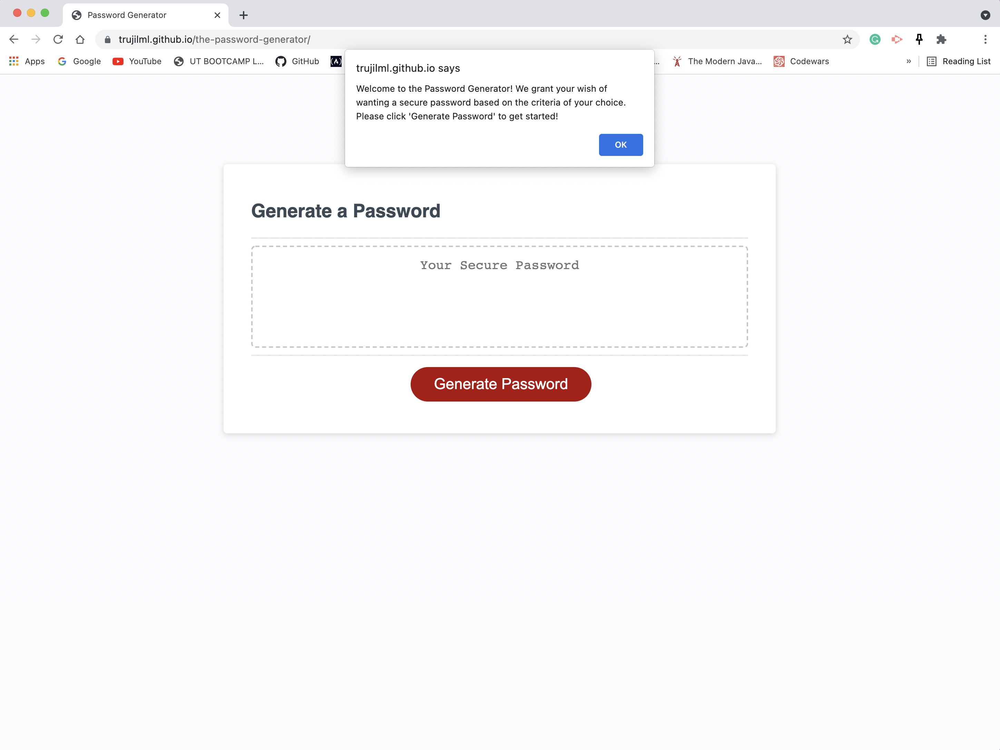
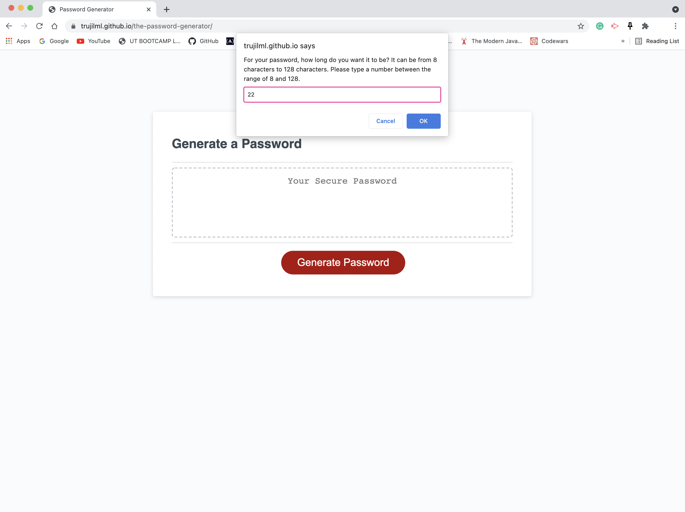
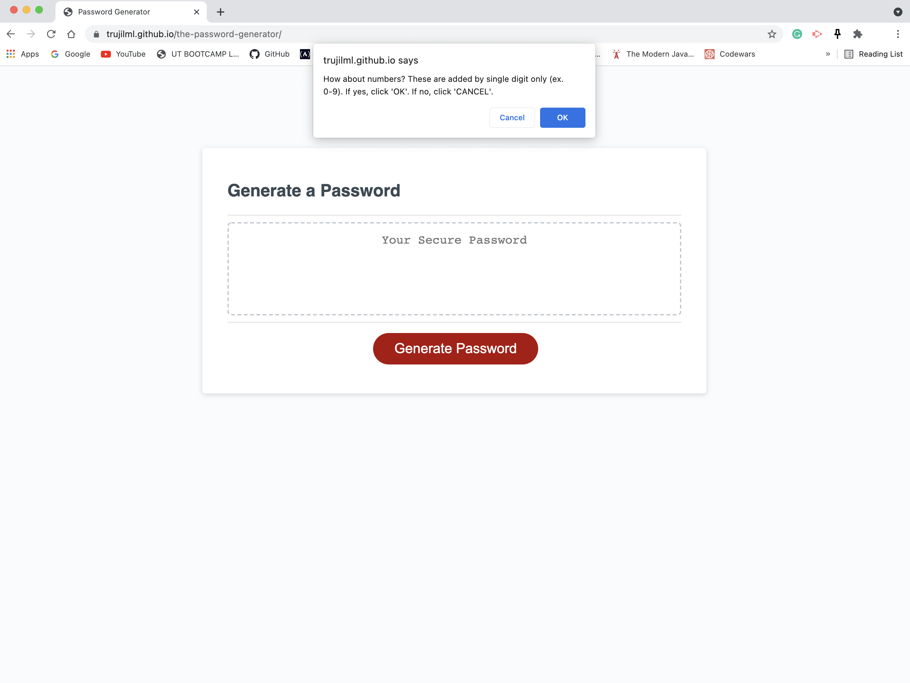
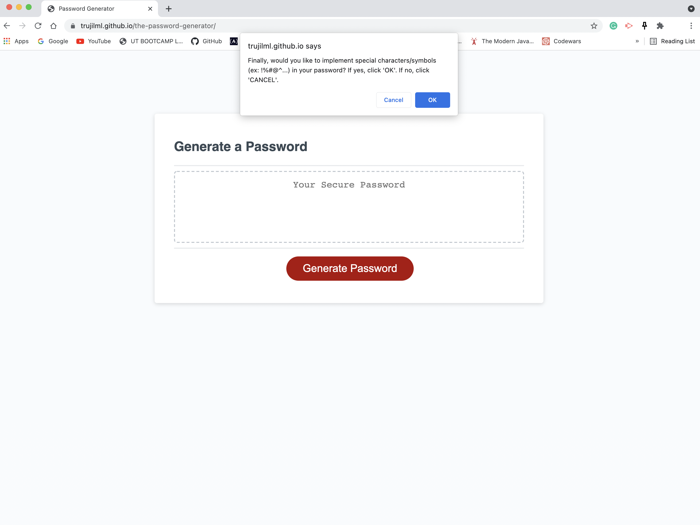
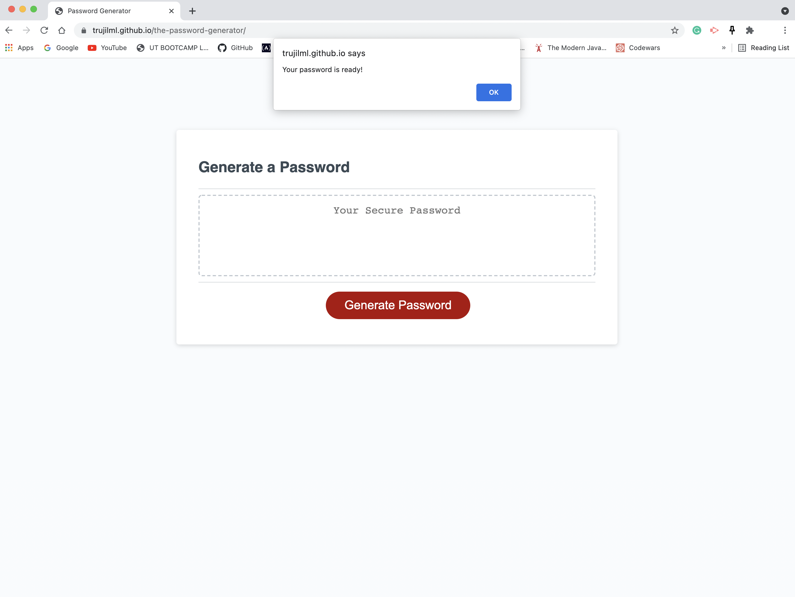
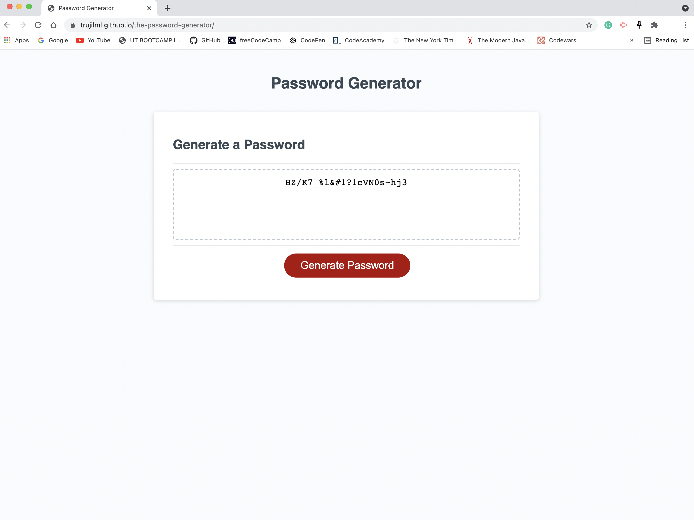
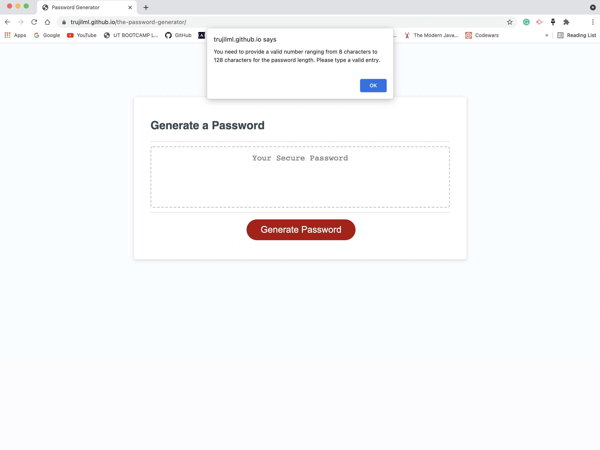
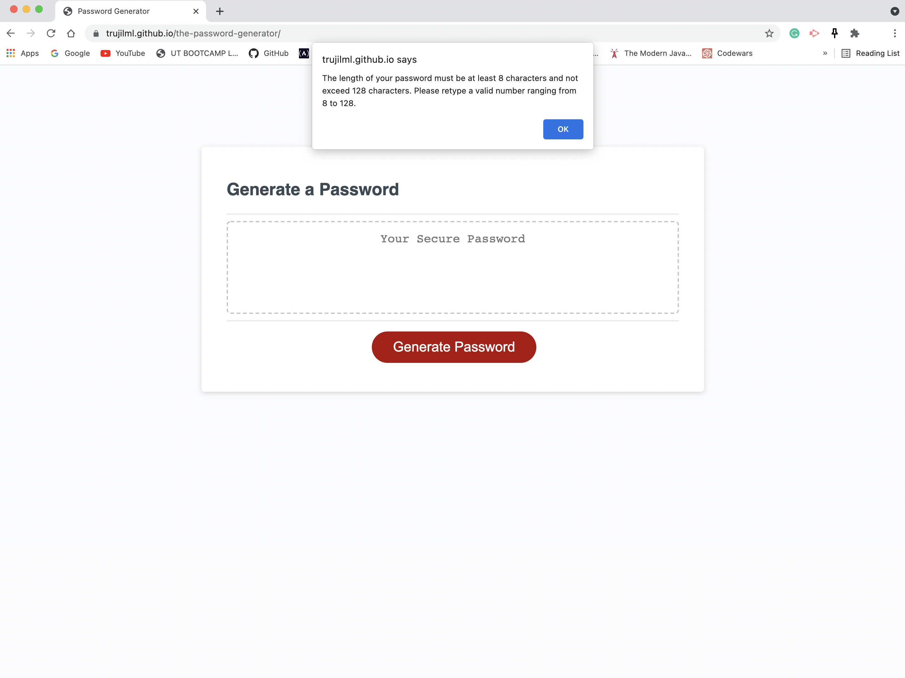
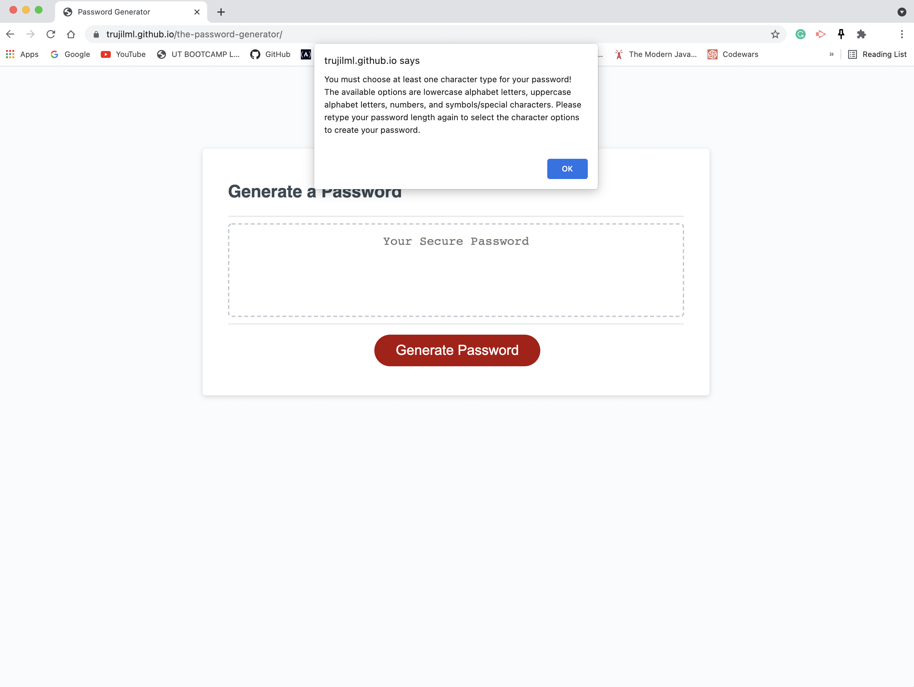

# Password Generator Starter Code
## Application Purpose
This is a password generator that generates strong, secure, and unique passwords as selected by specific requests from the user. When the "Generate Password" is clicked, the user is welcomed with a series of prompts on the criteria they want for the password. Character length is answered first, with the character range of at least 8 characters and no more than 128 characters. This is soon followed by the character type prompts (lowercase letters, uppercase letters, single-digit numbers, and/or special characters) which are confirmed by the user. With the length and at least one character type specified, the user input is validated and prints out the user's generated password on the page. 

## Password Generator Built With
* JavaScript
* HTML
* CSS

## Website Links
* GitHub Repository - https://github.com/trujilml/the-password-generator
* Deployed Link - https://trujilml.github.io/the-password-generator/

## Screenshots
These screenshots demonstrates how the site works for a user who specifies a password with the length of 22 characters and all of the character types added. The last screenshots demonstrate when no length is entered or if less than 8 characters/more than 128 characters is entered, and if no character type is selected at all. When no length is specified, over or under the character requirements, or no character type is selected - the password generator restarts by asking the user for their password length input. 

## Special Thanks
Special thanks to Vicky, the teaching assistant in my bootcamp course. Your help is greatly appreciated and encouraged me to do my best with this assignment!
